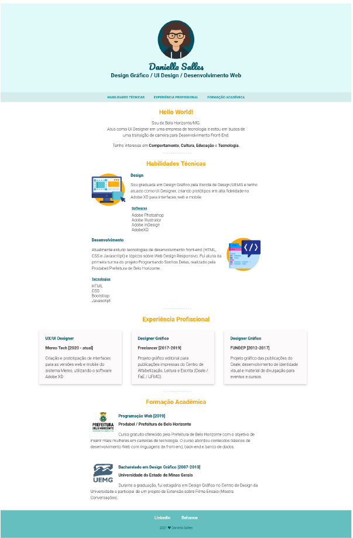

# Currículo Profissional - Daniella Salles #

  
 

 

Projeto desenvolvido durante os módulos HTML e CSS do curso [**"The Complete 2021 Web Development Bootcamp"**](https://www.udemy.com/course/the-complete-web-development-bootcamp/), disponível na Udemy.
 

---

## Screenshot ##

 

---

## Autoria ##

<b>Daniella Salles</b>
 

